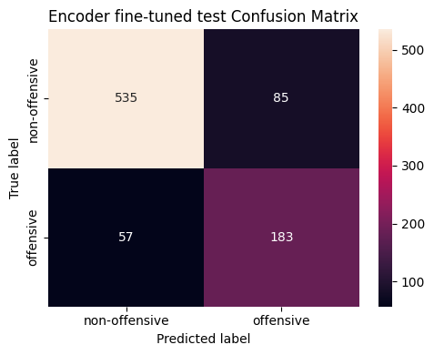
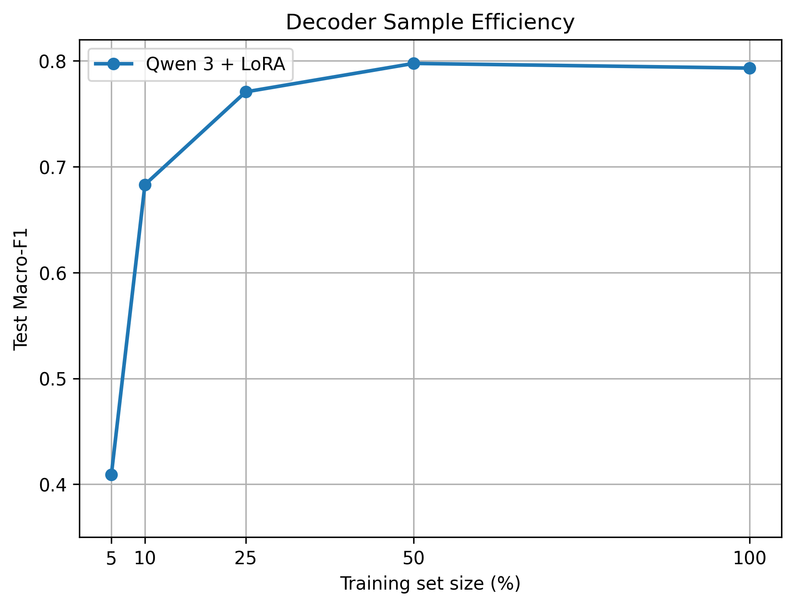

# Encoder vs. Decoder Offensive-Language Detection

A comparison of encoder and decoder language models for offensive-language detection on the `cardiffnlp/tweet_eval` offensive dataset.

## Approach

- Audited class balance and tweet-length distributions across train, validation, and test splits.
- Fine-tuned `roberta-base` as a weighted sequence-classification encoder.
- Evaluated the encoder before and after fine-tuning.
- Prompted `Qwen/Qwen3-0.6B` as a causal decoder and then instruction-tuned it with LoRA.
- Used class-weighted losses, confusion matrices, learning curves, integrated-gradients token attributions, and sample-efficiency experiments using 5%, 10%, 25%, 50%, and 100% of training data.

## Results

| Model | Validation macro-F1 | Test macro-F1 |
| --- | ---: | ---: |
| RoBERTa fine-tuned | 0.7818 | 0.7832 |
| Qwen3 zero-shot | 0.2248 | |
| Qwen3 + LoRA | 0.7932 | 0.7932 |

The LoRA decoder achieved the strongest reported test macro-F1, narrowly ahead of the fully fine-tuned encoder. Decoder sample efficiency decreased as the training fraction became smaller, while the encoder remained comparatively robust down to 10% of the training data.

## Repository Contents

- [`offensive_language_model_comparison.ipynb`](offensive_language_model_comparison.ipynb): complete analysis and experiments.
- [`report.pdf`](report.pdf): written report.
- PNG files: class distributions, learning curves, confusion matrices, sample-efficiency curves, and attribution visualizations.
- `roberta_offensive_classifier/` and `lora_offensive_classifier/`: saved model artifacts.

## Reproduce

Install the packages listed in [`requirements.txt`](requirements.txt), then run the notebook in order. The TweetEval dataset and Hugging Face models are downloaded at runtime. A CUDA-capable GPU with substantial memory is strongly recommended for Qwen3 and LoRA training; decoder mixed precision is enabled only when CUDA is available.

## Limitations

TweetEval labels are dataset-specific and offensive-language judgments can be context-dependent. Decoder generation can produce outputs outside the two expected labels, and model artifacts are large for standard Git hosting. The reported metrics are the notebook's existing experimental results and should be regenerated after changing dependencies or checkpoints.
